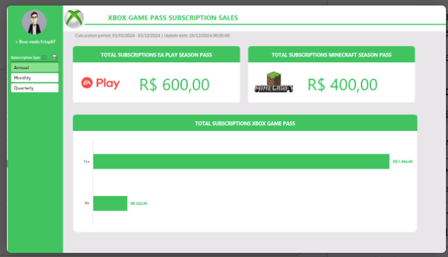

[README (1).md](https://github.com/user-attachments/files/33134574/README.1.md)
# 🎮 Dashboard de Vendas — Xbox Game Pass Subscription Sales

> Dashboard interativo em Excel que transforma dados brutos de assinaturas do Xbox Game Pass em informações visuais claras para apoiar a análise de desempenho de vendas.
> Desafio de projeto da plataforma **DIO** em parceria com o **Santander**.




---

## 📑 Sumário

1. [Sobre o desafio](#-sobre-o-desafio)
2. [Perguntas de negócio](#-perguntas-de-negócio)
3. [Estrutura do repositório](#-estrutura-do-repositório)
4. [Dados utilizados](#-dados-utilizados)
5. [Estrutura do arquivo Excel](#-estrutura-do-arquivo-excel)
6. [Resultados](#-resultados)
7. [Como reproduzir](#-como-reproduzir-passo-a-passo)
8. [Recursos do Excel utilizados](#-recursos-do-excel-utilizados)
9. [Aprendizados](#-aprendizados)
10. [Melhorias futuras](#-melhorias-futuras)
11. [Autor](#-autor)

---

## 🎯 Sobre o desafio

O objetivo é **criar um dashboard de vendas** com foco em organização e visualização de dados, permitindo analisar o desempenho das vendas e apoiar decisões baseadas em dados.

Neste projeto, a base contém assinaturas do plano **Ultimate** do Xbox Game Pass, com informações de tipo de assinatura (mensal, trimestral e anual), renovação automática, complementos (**EA Play Season Pass** e **Minecraft Season Pass**) e cupons de desconto.

## ❓ Perguntas de negócio

A aba de cálculos responde às seguintes perguntas, todas para **planos anuais**:

1. Qual o faturamento total de vendas de planos anuais (todas as assinaturas agregadas)?
2. Qual o faturamento dos planos anuais separado por **com** e **sem** renovação automática?
3. Qual o total de vendas das assinaturas do **EA Play**?
4. Qual o total de vendas das assinaturas do **Minecraft Season Pass**?

## 🗂️ Estrutura do repositório

```text
dashboard-vendas-xbox/
├── README.md
├── planilha/
│   └── vendas_xbox.xlsx          # Excel com o dashboard concluído
├── images/
│   └── dashboard.png             # Captura de tela do dashboard
└── docs/
    └── dicionario-de-dados.md    # Descrição de cada coluna da base
```

## 📊 Dados utilizados

A aba **BASES** contém **98 registros** de assinaturas iniciadas entre **01/01/2024 e 14/12/2024**, com 13 colunas:

| Coluna | Descrição |
|---|---|
| Subscriber ID | Identificador do assinante |
| Name | Nome do assinante |
| Plan | Plano contratado (todos `Ultimate`) |
| Start Date | Data de início da assinatura |
| Auto Renewal | Renovação automática (`Yes`/`No`) |
| Subscription Price | Preço da assinatura (R$ 15) |
| Subscription Type | Tipo: `Monthly`, `Quarterly` ou `Annual` |
| EA Play Season Pass | Adquiriu o EA Play (`Yes`/`No`) |
| EA Play Season Pass Price | Valor do EA Play (R$ 30) |
| Minecraft Season Pass | Adquiriu o Minecraft Season Pass (`Yes`/`No`) |
| Minecraft Season Pass Price | Valor do Minecraft Season Pass (R$ 20) |
| Coupon Value | Valor do cupom de desconto aplicado |
| Total Value | Valor total da venda |

**Regra do valor total:** `Total Value = Subscription Price + EA Play Price + Minecraft Price − Coupon Value` (conferido para os 98 registros).

**Distribuição por tipo de assinatura:** 45 mensais, 33 trimestrais e 20 anuais. Entre as anuais, 18 têm renovação automática e 2 não têm.

Detalhes completos em [`docs/dicionario-de-dados.md`](docs/dicionario-de-dados.md).

## 🧩 Estrutura do arquivo Excel

O arquivo `planilha/vendas_xbox.xlsx` possui 4 abas:

| Aba | Função |
|---|---|
| **DASHBOARD** | Painel final com cartões de KPI, gráfico e filtro (segmentação) por tipo de assinatura |
| **CÁLCULOS** | Tabelas dinâmicas que respondem às perguntas de negócio e alimentam o dashboard |
| **BASES** | Dados brutos das assinaturas |
| **ASSETS** | Paleta de cores e imagens (logos) usadas no layout |

**Paleta de cores:** verde Xbox `#22C55E` (cor principal), `#9BC848`, `#2AE6B1` e `#5BF6A8` (menus) e cinza `#E8E6E9` (fundo).

## 📈 Resultados

Com o filtro **Annual** selecionado, o dashboard apresenta:

| Indicador | Valor |
|---|---|
| Total de assinaturas EA Play Season Pass | **R$ 600,00** |
| Total de assinaturas Minecraft Season Pass | **R$ 400,00** |
| Faturamento anual **com** renovação automática | **R$ 1.064,00** |
| Faturamento anual **sem** renovação automática | **R$ 122,00** |
| Faturamento total dos planos anuais | **R$ 1.186,00** |

**Leitura rápida:** cerca de 90% do faturamento dos planos anuais vem de clientes com renovação automática ativa, o que mostra o peso da recorrência na receita.

## 🔁 Como reproduzir (passo a passo)

1. **Prepare a base:** organize os dados na aba `BASES` com uma linha por assinatura e os cabeçalhos descritos acima. Confirme que as datas estão no formato de data e os valores, numéricos.
2. **Crie a aba `CÁLCULOS`** e insira tabelas dinâmicas a partir da base (**Inserir → Tabela Dinâmica**):
   - **Faturamento por renovação automática:** Linhas = `Auto Renewal`; Valores = Soma de `Total Value`.
   - **Vendas do EA Play:** Linhas = `Auto Renewal`; Valores = Soma de `EA Play Season Pass Price`.
   - **Vendas do Minecraft:** Linhas = `Auto Renewal`; Valores = Soma de `Minecraft Season Pass Price`.
3. **Adicione a segmentação de dados:** selecione uma tabela dinâmica → **Analisar Tabela Dinâmica → Inserir Segmentação de Dados** → campo `Subscription Type`. Em **Conexões de Relatório**, conecte a segmentação às três tabelas para filtrá-las ao mesmo tempo.
4. **Crie a aba `DASHBOARD`:** oculte as linhas de grade (**Exibir → Linhas de Grade**) e aplique a cor de fundo cinza da paleta.
5. **Monte o layout:** barra lateral verde com a segmentação, título no topo e cartões brancos com cantos arredondados para os indicadores.
6. **Cartões de KPI:** insira caixas de texto e vincule cada uma a uma célula de total (selecione a caixa e digite `=CÁLCULOS!F24` na barra de fórmulas, por exemplo). Assim o valor atualiza com o filtro.
7. **Gráfico:** a partir da tabela de faturamento, insira um **gráfico de barras** e remova linhas de grade e eixos desnecessários. Mostre rótulos de dados e use o verde Xbox.
8. **Acabamento:** adicione os logos (EA Play, Minecraft e Xbox) e o texto do período de cálculo e da data de atualização.
9. **Teste** os botões da segmentação (Annual, Monthly, Quarterly) para ver os cartões e o gráfico mudarem.

> 💡 Se alterar a base, use **Dados → Atualizar Tudo** para recalcular as tabelas dinâmicas.

## 🛠️ Recursos do Excel utilizados

- **Tabelas dinâmicas** para agregar vendas
- **Segmentação de dados** (slicer) interativa por tipo de assinatura
- **Gráfico de barras** com rótulos de dados
- **Caixas de texto vinculadas a células** para os KPIs dinâmicos
- Função **GETPIVOTDATA** para extrair totais das tabelas dinâmicas
- Identidade visual com paleta de cores, logos e cantos arredondados

## 📚 Aprendizados

- Transformar dados brutos em indicadores claros e acionáveis
- Estruturar o arquivo em camadas: dados (BASES), cálculos (CÁLCULOS) e visualização (DASHBOARD)
- Criar interatividade com segmentação de dados conectada a várias tabelas dinâmicas
- Aplicar princípios de design (cores, alinhamento, hierarquia visual) em dashboards
- Documentar um projeto de dados para portfólio no GitHub

## 🚀 Melhorias futuras

- Evolução mensal de vendas (gráfico de linhas por `Start Date`)
- Segmentações adicionais (renovação automática, mês de início)
- Comparativo entre mensal, trimestral e anual
- Indicador de impacto dos cupons no faturamento
- Versão em Power BI

## 👤 Autor

**Frizzo** — [@frtop87](https://github.com/frtop87)

Projeto desenvolvido no bootcamp da [DIO](https://www.dio.me/) em parceria com o **Santander**.
